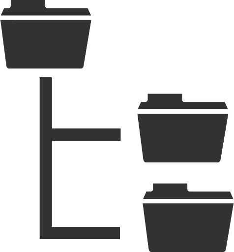

<a name="readme-top"></a>

[![MIT License][license-shield]][license-url]
[![LinkedIn][linkedin-shield]][linkedin-url]


<!-- PROJECT LOGO -->
<br />
<div align="center">
  <a href="https://github.com/othneildrew/Best-README-Template">
    
  </a>
 

---
  <h3 align="center">PyFolderSync</h3>

  <p align="center">
    Time based One-way Folder synchronization
    <br />
    <br />
    <a href="https://github.com/joao-paulo-santos/PyFolderSync/issues">Report Bug</a>
    ·
    <a href="https://github.com/joao-paulo-santos/PyFolderSync/issues">Request Feature</a>
  </p>
</div>


<!-- ABOUT THE PROJECT -->
## About The Project

This is a tiny test project requested by Veeam Software as a proof-of-skill.

Requested Features:
- One-Way Synchronization between folders
- Periodic Synchronization
- Logging of actions
- No use of third-party libraries to obtain the core funcionality

---

```diff
! Disclaimer: python is not my main expertise, as such I might not know some of the language quirks.

Python was chosen to take advantage of this project as a learning experience.
```

---

<p align="right">(<a href="#readme-top">back to top</a>)</p>


### Built With

 [![Python][Python-Shield]][Python-url]

<p align="right">(<a href="#readme-top">back to top</a>)</p>


<!-- GETTING STARTED -->
## Getting Started

### Prerequisites

- Python installed

### Installation

 - Clone the repo
```sh
git clone https://github.com/joao-paulo-santos/PyFolderSync.git
```


<p align="right">(<a href="#readme-top">back to top</a>)</p>


<!-- USAGE EXAMPLES -->
## Usage

 - Starting the program: 
```sh
python PyFolderSync.py $source_folder $replica_folder $interval $logfile

#Usage Example
python PyFolderSync.py "./dev" "./devcopy" 10 log.txt
```
This will create a thread that Synchronizes the folders every x seconds while leaving the main thread intact to receive further user input.

After the program is running you will be presented with this console menu:


    1. This option will simply show every thread running.
    2. This option will allow the user to provide arguments to create a new Synchronization thread.
    3. This option will close the main thread and order every other thread to close after its current task is finished, safely closing the program without needing to worry about memory corruption.

<p align="right">(<a href="#readme-top">back to top</a>)</p>


<!-- ROADMAP -->
## Roadmap

- [ ] Caching (per thread)
    - [X] Cache file MD5 sums for quick lookup
    - [ ] Cache last modified values
    - [ ] Implement Cache size limit in bytes
- [ ] Menu option to close only a specific thread
- [ ] Start the program with a list of folders to sync
- [ ] Start the program without specifying a starting folder to sync
- [ ] Two-way Synchronization
- [ ] Make Locks replica folder dependant


See the [open issues](https://github.com/joao-paulo-santos/PyFolderSync/issues) for a full list of proposed features (and known issues).

<p align="right">(<a href="#readme-top">back to top</a>)</p>

## Technical Sketch


<!-- CONTRIBUTING -->
## Contributing

Contributions are what makes the open source community such an amazing place to learn, inspire, and create. Any contributions you make are **greatly appreciated**.

If you have a suggestion that would make this better, please fork the repo and create a pull request. You can also simply open an issue with the tag "enhancement".
Don't forget to give the project a star! Thanks again!

1. Fork the Project
2. Create your Feature Branch (`git checkout -b feature/AmazingFeature`)
3. Commit your Changes (`git commit -m 'Add some AmazingFeature'`)
4. Push to the Branch (`git push origin feature/AmazingFeature`)
5. Open a Pull Request

<p align="right">(<a href="#readme-top">back to top</a>)</p>


<!-- LICENSE -->
## License

Distributed under the Apache-2 License. See `LICENSE` for more information.

<p align="right">(<a href="#readme-top">back to top</a>)</p>


<!-- CONTACT -->
## Contact

João Santos - [Linkedin](https://www.linkedin.com/in/jo%C3%A3o-santos-015a082b9/)

Project Link: [https://github.com/joao-paulo-santos/PyFolderSync](https://github.com/joao-paulo-santos/PyFolderSync)

<p align="right">(<a href="#readme-top">back to top</a>)</p>


[license-shield]: https://img.shields.io/pypi/l/giteo?style=for-the-badge
[license-url]: https://github.com/joao-paulo-santos/PyFolderSync/blob/master/LICENSE
[linkedin-shield]: https://img.shields.io/badge/-LinkedIn-black.svg?style=for-the-badge&logo=linkedin&colorB=555
[linkedin-url]: https://www.linkedin.com/in/jo%C3%A3o-santos-015a082b9/
[Python-shield]: https://img.shields.io/badge/python-3670A0?style=for-the-badge&logo=python&logoColor=ffdd54
[Python-url]: https://www.python.org/